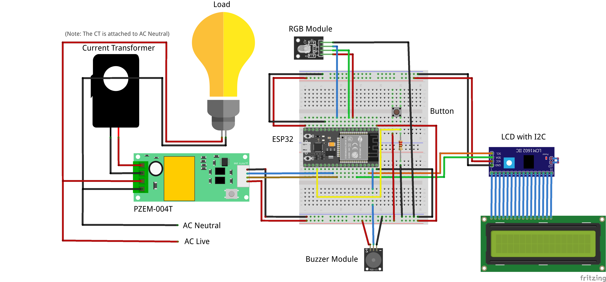

# IoMeter
> *Arduino-based Smart Energy Meter (Electronics)*

### Key Idea
The objective of this project is to create an Arduino and IoT-based solution that monitors the electricity/energy consumption rates of households and buildings. The system will send this data to a server for monitoring purposes and also provide users with alerts if their energy consumption exceeds a certain threshold range. This will help users become more aware of their electricity usage, enabling them to make informed decisions to reduce their usage after receiving the alert.

The hardware is responsible for handling the physical aspects of the system. This includes measuring sensor data, pre-processing the data for transmission through the internet, and managing the actuators to interact in the real-world.

### Breadboard Diagram
The connection of different components that make up the system can be found below in the breadboard diagram.

### Sensors and Actuators
The operation of each sensor and actuator are furthermore discussed.

- ESP32 - The microcontroller of the system that controls the sensors and actuators in terms of measuring of data, along with sending commands and processing of POST requests to the server.

- PZEM-004T Multifunction AC Digital Meter Module and Current Transformer - The main sensor of the system conveniently packed in a module that sends data through serial communication. Sensor data such as voltage, current, power, energy, frequency and power factor are measured via the corresponding Arduino library. The module needs to be connected to a current transformer running along AC neutral wire.

- 16x2 Liquid Crystal Display (LCD) with I2C Interface Module - This component displays the computed cost (in pesos), the energy (in kWh) and power (in W) in accordance with the system. The I2C interface makes the wiring straightforward and the module easier to control.

- KY016 RGB Module - This component emits light in various colors which is used in the system as indicator of different states according to the specification.

- Active Alarm Buzzer Module - This component emits sound in various frequencies which is used in the system as indicator of different states according to the specification.

